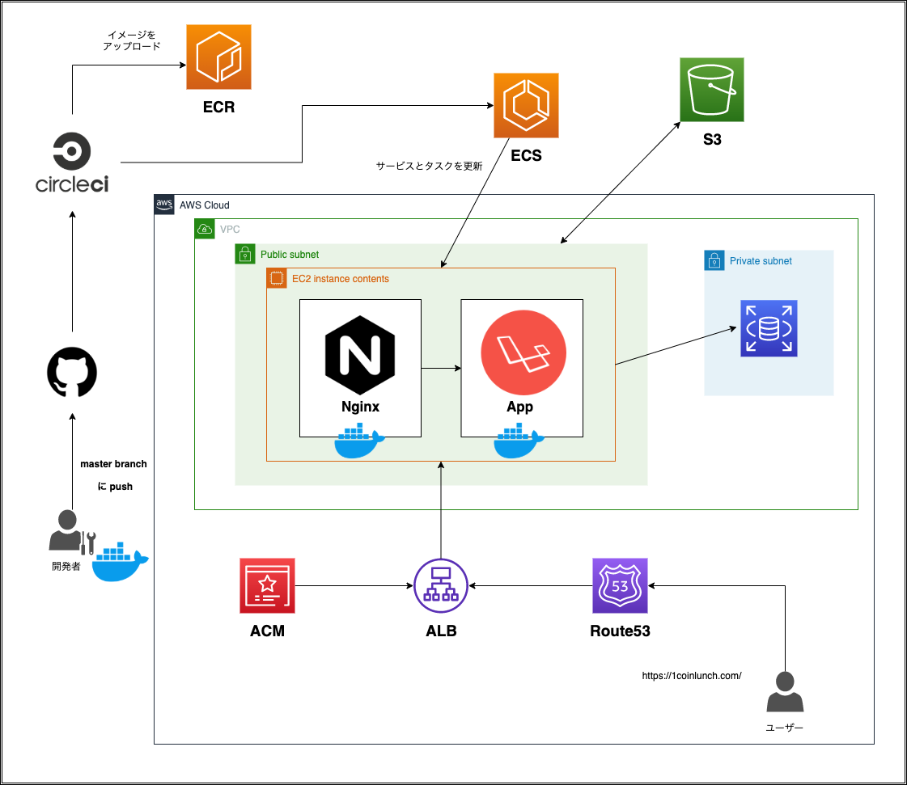

# ワンコインランチ

## 概要
### 「みんなでワンコインランチを広めよう」
#### 飲食店のランチはメニューが頻繁に変わったり、安くて美味しい露店販売が多くあります。しかし、頻繁に変わるメニューや露店販売は、ネットの記事にはあまり掲載されていない。そのため、口コミでランチを探せるSNSがあれば便利だと思いました。
 

***
 

## リンク
### https://1coinlunch.com
 

***
 

## クラウドアーキテクチャー
 

***
 

## 開発環境
* フロントエンド
  * JavaScript
  * jQuery
  * Vue

* バックエンド
  * PHP
  * Laravel

* DB
  * MySQL

* インフラ
  * nginx
  * Docker
  * docker-compose
  * CircleCI

* AWS
  * ALB
  * EC2
  * RDS
  * ACM
  * Route 53
  * S3
  * ECS
  * ECR

* GCP
  * Maps JavaScript API

 

***
 

## 機能一覧
  * ユーザー登録、詳細、編集、削除
  * twitterソーシャルログイン
  * 簡単ログイン (気軽にログインでき、全ての機能を体験できます。)
  * 店舗一覧、詳細、作成、編集、削除
  * 画像編集、画像プレビュー
  * 条件から絞り込み検索
  * 地図から検索
  * キーワード検索
  * お気に入り機能
  * お問い合わせ